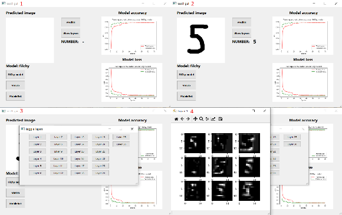
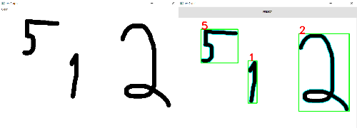
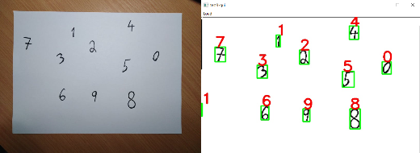

# Handwritten digit recognition GUI
Handwritten digit recognition GUI in Python composed of two parts.
## Process
- [ ] Train models
- [ ] Start application

##### Train models
- python filchy_model.py
- python mobilenet_model.py
- python vgg16_model.py

##### Run app
- python main.py

##### Results
- [x] Trained models
- [x] Started application

## Dependencies
* python 3.5
* cv2
* tensorflow
* numpy
* pyqt5
## Results
#### Main menu

#### Test 1

#### Test 2

#### Test 3

## Info
This project was used for [SPA (Students Professional Activities)](http://www.soc.cz/). I was trying to explain by this simple app how Convolutional neural networks work. I used 3 models of which one was created by me (**filchy model**). This model was placed 60th out of 1300th contestants in the [competition](https://www.kaggle.com/c/Kannada-MNIST).
